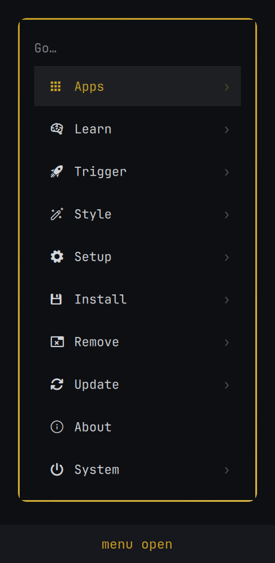

# Readline Keys

`Ctrl+N` / `Ctrl+P` / `Ctrl+F` / `Ctrl+B` navigation in [Omarchy](https://omarchy.org)'s
keyboard-driven popups, **without forking a single line of them**.

<p align="center">
  
</p>

| Surface | `Ctrl+P` | `Ctrl+N` | `Ctrl+B` | `Ctrl+F` |
|---|---|---|---|---|
| Menu (`Super+Space`) | up | down | back a level | descend / activate |
| Clipboard | up | down | not bound | not bound |
| Emojis | row up | row down | previous emoji | next emoji |
| Image picker | previous | next | previous | next |

Emacs semantics: `N`/`P` move by line, `F`/`B` move within it, which is why the
mapping lands exactly on the emoji grid, and why the menu's `F`/`B` follow its
existing Right/Left (descend/back) rather than paging.

Every stock binding still works. Arrows, `PageUp`/`PageDown`, `Enter`, `Escape`,
`Delete`, `Ctrl+U`: all untouched. Only the four chords Omarchy ignores are claimed,
and only when Control alone is held, so `Ctrl+Shift+N` stays free.

## Install

```bash
omarchy plugin add https://github.com/itsgg/omarchy-readline-keys.git --enable
omarchy restart shell
```

Update with `omarchy plugin update itsgg.readline-keys`, remove with
`omarchy plugin remove itsgg.readline-keys`.

## Why this exists

Omarchy hardcodes popup navigation in `if`/`else if` chains over `event.key`, and
none of these surfaces uses a real text input, so Qt's standard Linux editing
keys never come into play. There is no config for it and no key-event hook.

The obvious workaround is `omarchy plugin clone`, which copies the plugin into
`~/.config/omarchy/plugins/`. That works once and then rots: a clone has no git
remote, `omarchy plugin update` only fast-forwards git-installed plugins, and
`omarchy update` does not itself update local plugins. So a cloned `Menu.qml`
keeps running the code it was copied from, forever, while upstream moves on.
You silently stop receiving every fix to the ~1900 lines you forked for the sake
of four keys.

**This plugin ships no upstream code at all.** It leaves the built-ins completely
stock and installs alongside them, so they keep updating with Omarchy normally.

## How it works

A `service` plugin is handed the live `shell` object at startup. From there:

1. `shell.panelLoaders` maps each popup's plugin id to its `Loader`, and
   `loader.item` is the popup's root, a plain `Item` exposing public functions
   (`select`, `goBack`, `activateIndex`, `selectAdjacent`).
2. Each popup renders into its own layer-shell window, so key events never reach
   that root. We descend through `contentItem` to find the popup's key handler:
   the deepest visible item declaring `focus: true`, preferring one that holds
   `activeFocus`, where key events are by definition being delivered. No ids or
   type names, so upstream can rename and restructure freely.
3. A small `Item` is parented under that handler and takes focus. Key events go
   to the focused item first, so our chords are handled there; **everything else
   propagates up to the original handler untouched**, including the letters that
   drive each popup's search filter.
4. A chord is only accepted where an action is actually bound, so `Ctrl+F` in the
   clipboard (a single column, no horizontal axis) propagates rather than dying.
   Per-surface guards also stand down while a confirmation dialog owns the keys.
5. Actions call the popup's own public functions. No behavior is reimplemented.

Clones are supported too: if you already run a cloned menu, the plugin resolves
it through the manifest's `clonedFrom` and attaches to the clone instead.

## If Omarchy changes underneath it

Usually a no-op rather than a breakage. If a future Omarchy restructures a popup
so the handler can't be found, that surface keeps its stock keys and the rest
carry on, and nothing can be left half-patched because nothing is patched. A
chord is also only claimed when its action actually runs, so a changed upstream
function means the key falls through to the popup instead of dying.

Handler discovery is still a heuristic, though: a restructure that leaves a
different focused item where the search looks could attach in the wrong place.
Worth a quick check after a major Omarchy upgrade. Set `debug: true` in
`Service.qml` to log what attached.

## The pattern is the reusable part

Four keybindings are the excuse; the interesting part is that Omarchy's built-in
popup plugins (anything of kind `panel`, `overlay` or `menu`) can be extended
this way: reached through `shell.panelLoaders`, driven by their own public
functions, without copying a line of them.

[**PATTERN.md**](PATTERN.md) writes that up properly: the injection points, how
to get inside a popup's layer-shell window, how to add key handling to an object
you did not declare, how to cope with clones, and the pitfalls that bite
(injected objects outliving your plugin, `keepLoaded` ignoring hot-reload,
invalidated QObject wrappers), plus where the technique genuinely does not
reach.

## Upstream

Several PRs propose adding these keys to Omarchy directly
([#7042](https://github.com/basecamp/omarchy/pull/7042),
[#7345](https://github.com/basecamp/omarchy/pull/7345),
[#7513](https://github.com/basecamp/omarchy/pull/7513),
[#7737](https://github.com/basecamp/omarchy/pull/7737),
[#8318](https://github.com/basecamp/omarchy/pull/8318)).
If one lands, this plugin becomes unnecessary: uninstall it and keep the stock
bindings. Until then it needs no one's approval to work.

Note that the wifi, bluetooth, tailscale and weather panels share
`Ui/PanelKeyCatcher.qml`, which lives outside the plugin tree. Those are out of
reach of any plugin and would need an upstream change.

## License

MIT. See [LICENSE](LICENSE).
