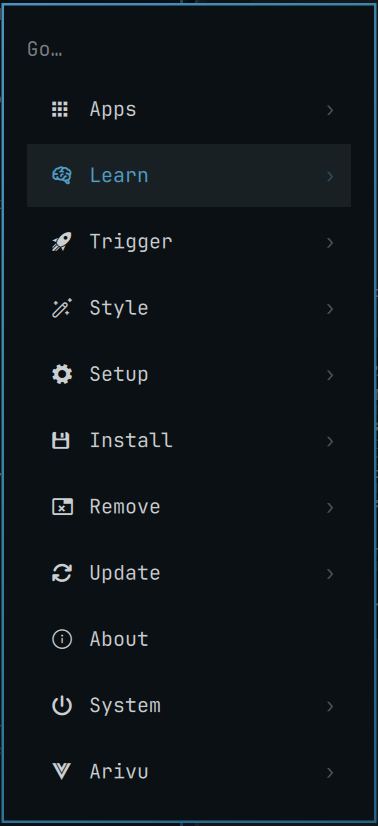
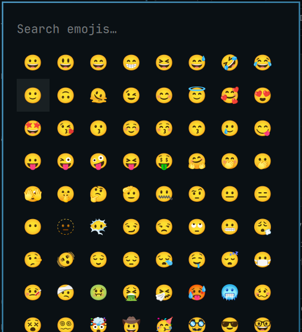

# Readline Keys

> **Withdrawn from the Omarchy plugin marketplace on 2026-09-24.**
>
> Omarchy 4.0.3 stopped handing plugins the shell and gave them a capability
> facade instead. The marketplace listing (`e99496d`) reads the shell the old way,
> so on 4.0.3 and 4.0.4 it loads and does nothing. The code in this repository
> reaches the shell through the QML creation context instead. That is what I run,
> but it attaches keys to popups this plugin does not own, which the marketplace
> review rightly refuses, and no supported plugin capability can do the same job.
>
> The feature belongs in Omarchy. For the menu, omacom/omarchy#7345 makes the
> navigation keys configurable. Once it lands, all of this plugin's menu keys
> except `Ctrl+[` for Escape, which stays hardcoded there, are a few lines in
> `~/.config/omarchy/extensions/omarchy-menu.jsonc`:
>
> ```jsonc
> "keybindings": {
>   "next":     ["CTRL + N"],
>   "prev":     ["CTRL + P"],
>   "activate": ["CTRL + F", "CTRL + M"],
>   "back":     ["CTRL + B"],
> },
> ```
>
> omacom/omarchy#7737 would do the same through `keys.menu` in `shell.json`.
> Clipboard, emojis and the image picker have no upstream equivalent yet. I plan
> a follow-up PR for those once the menu change settles which mechanism to use.

`Ctrl+N` / `Ctrl+P` / `Ctrl+F` / `Ctrl+B` navigation, plus `Ctrl+M` for `Enter`
and `Ctrl+[` for `Escape`, in [Omarchy](https://omarchy.org)'s keyboard-driven
popups, **without forking a single line of them**.

<p align="center">
  
</p>

| Surface | `Ctrl+P` | `Ctrl+N` | `Ctrl+B` | `Ctrl+F` |
|---|---|---|---|---|
| Menu (`Super+Space`) | up | down | back a level | descend / activate |
| Clipboard | up | down | not bound | not bound |
| Emojis | row up | row down | previous emoji | next emoji |
| Image picker | previous | next | previous | next |

Emacs semantics: `N`/`P` move by line, `F`/`B` move within it, which is why the
mapping lands exactly on the emoji grid, and why the menu's `F`/`B` follow its
existing Right/Left (descend/back) rather than paging.

<p align="center">
  
  &nbsp;&nbsp;
  
</p>

<p align="center"><sub>The stock menu and emoji picker, unmodified, after <code>Ctrl+N</code>.</sub></p>

On top of that, `Ctrl+M` is `Enter` and `Ctrl+[` is `Escape` on all four surfaces:
the terminal control codes for CR and ESC, doing exactly what the real key does
there, including `Escape`'s habit of clearing a non-empty filter before it closes
the popup. (While a confirmation dialog owns the keys, as the menu's uninstall
prompt does, this plugin stands down entirely and you need the real `Escape`.)

Every stock binding still works. Arrows, `PageUp`/`PageDown`, `Enter`, `Escape`,
`Delete`, `Ctrl+U`: all untouched. Only the six chords Omarchy ignores are claimed,
and only when Control alone is held, so `Ctrl+Shift+N` stays free.

## Install

```bash
omarchy plugin add https://github.com/itsgg/omarchy-readline-keys.git --enable
omarchy restart shell
```

Also listed on the
[Omarchy plugin marketplace](https://omarchyplugins.com/plugin.html?id=io.github.itsgg.readline-keys).

Update with `omarchy plugin update io.github.itsgg.readline-keys`, remove with
`omarchy plugin remove io.github.itsgg.readline-keys`.

If `omarchy plugin list` still shows this plugin as `itsgg.readline-keys`, you
have the old id: remove it under that name and add it again. Updating in place
would leave a directory named for the old id holding a manifest declaring the
new one.

## Why this exists

Omarchy hardcodes popup navigation in `if`/`else if` chains over `event.key`, and
none of these surfaces uses a real text input, so Qt's standard Linux editing
keys never come into play. There is no config for it and no key-event hook.

The obvious workaround is `omarchy plugin clone`, which copies the plugin into
`~/.config/omarchy/plugins/`. That works once and then rots: a clone has no git
remote, `omarchy plugin update` only fast-forwards git-installed plugins, and
`omarchy update` does not itself update local plugins. So a cloned `Menu.qml`
keeps running the code it was copied from, forever, while upstream moves on.
You silently stop receiving every fix to the ~1900 lines you forked for the sake
of six keys.

**This plugin ships no upstream code at all.** It leaves the built-ins completely
stock and installs alongside them, so they keep updating with Omarchy normally.

## How it works

A `service` plugin reaches the live `shell` object at startup (how it reaches it
changed in [Omarchy 4.0.3](#omarchy-403)). From there:

1. `shell.panelLoaders` maps each popup's plugin id to its `Loader`, and
   `loader.item` is the popup's root, a plain `Item` exposing public functions
   (`select`, `goBack`, `activateIndex`, `selectAdjacent`).
2. Each popup renders into its own layer-shell window, so key events never reach
   that root. We descend through `contentItem` to find the popup's key handler:
   the deepest visible item declaring `focus: true`, preferring one that holds
   `activeFocus`, where key events are by definition being delivered. No ids or
   type names, so upstream can rename and restructure freely.
3. A small `Item` is parented under that handler and takes focus. Key events go
   to the focused item first, so our chords are handled there; **everything else
   propagates up to the original handler untouched**, including the letters that
   drive each popup's search filter.
4. A chord is only accepted where an action is actually bound, so `Ctrl+F` in the
   clipboard (a single column, no horizontal axis) propagates rather than dying.
   Per-surface guards also stand down while a confirmation dialog owns the keys.
5. Actions call the popup's own public functions. No behavior is reimplemented.

Clones are supported too: if you already run a cloned menu, the plugin resolves
it through the manifest's `clonedFrom` and attaches to the clone instead.

## Omarchy 4.0.3

4.0.3 (10 September 2026) narrowed what a third-party plugin is handed. The
shell used to inject the live `ShellRoot` into a plugin property named `shell`;
it now injects a capability-scoped facade (`PluginShellApi`) carrying the
plugin's own id, bar state and lifecycle calls. That facade has no
`panelLoaders` and no `openPanelIds`, so every release of this plugin up to
2.0.0 stopped attaching on 4.0.3, and stopped silently, because finding nothing
to attach to is indistinguishable from having nothing to do. Third-party
`service` plugins are created with no QObject parent there as well, so walking
out through the object tree is not an alternative.

So it no longer depends on that injection. It declares no `shell` property at
all, which leaves the name free for QML's creation context: the shell builds
every plugin object from `shell.qml`'s own scope, where `shell` is the
`ShellRoot` id, and the expression resolves to the live shell on 4.0.2 and
4.0.3 alike.

That is outside what the facade means to expose, so it is worth being exact
about what it touches. 4.0.3's security boundary is elsewhere and is not
weakened here: authentication services (lock, polkit) are held outside both the
public service map and the reachable object graph, and nothing in this plugin
goes near them. What it reaches is the panel loaders for popups you have open
anyway. Upstream may still close the path, which is why failure is now loud: if
the shell stops being reachable, the shell log says so once, and every stock key
still works.

## If Omarchy changes underneath it

Usually a no-op rather than a breakage. If a future Omarchy restructures a popup
so the handler can't be found, that surface keeps its stock keys and the rest
carry on, and nothing can be left half-patched because nothing is patched. A
chord is also only claimed when its action actually runs, so a changed upstream
function means the key falls through to the popup instead of dying.

Handler discovery is still a heuristic, though: a restructure that leaves a
different focused item where the search looks could attach in the wrong place.
Worth a quick check after a major Omarchy upgrade. Set `debug: true` in
`Service.qml` to log what attached.

Losing the shell itself is the one failure that cannot be a no-op, so it is
reported rather than absorbed: `readline-keys: the shell's panel loaders are not
reachable` in `qs -p /usr/share/omarchy/shell log` means this plugin is doing
nothing at all and the release has moved. Nothing else changes.

## The pattern is the reusable part

Six keybindings are the excuse; the interesting part is that Omarchy's built-in
popup plugins (anything of kind `panel`, `overlay` or `menu`) can be extended
this way: reached through `shell.panelLoaders`, driven by their own public
functions, without copying a line of them.

[**PATTERN.md**](PATTERN.md) writes that up properly: the injection points, how
to get inside a popup's layer-shell window, how to add key handling to an object
you did not declare, how to cope with clones, and the pitfalls that bite
(injected objects outliving your plugin, `keepLoaded` ignoring hot-reload,
invalidated QObject wrappers), plus where the technique genuinely does not
reach.

## Upstream

Several PRs propose adding these keys to Omarchy directly
([#7042](https://github.com/basecamp/omarchy/pull/7042),
[#7345](https://github.com/basecamp/omarchy/pull/7345),
[#7513](https://github.com/basecamp/omarchy/pull/7513),
[#7737](https://github.com/basecamp/omarchy/pull/7737),
[#8318](https://github.com/basecamp/omarchy/pull/8318)).
If one lands, this plugin becomes unnecessary: uninstall it and keep the stock
bindings. Until then it needs no one's approval to work.

Note that the wifi, bluetooth, tailscale and weather panels share
`Ui/PanelKeyCatcher.qml`, which lives outside the plugin tree. Those are out of
reach of any plugin and would need an upstream change.

## License

MIT. See [LICENSE](LICENSE).
